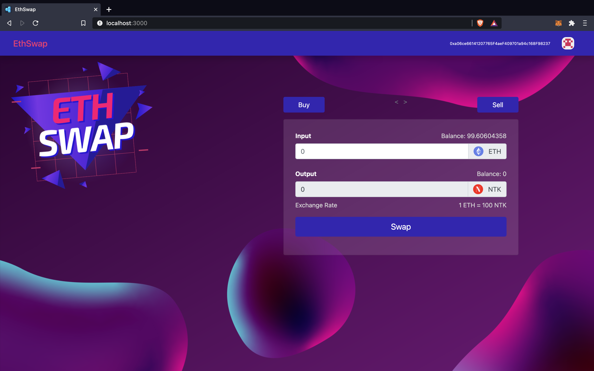

# EthSwap

EthSwap is a DeFi platform to trade/convert Ethereum (ETH) to another cryptocurrency, here Nomad Token (NTK), and vice-versa. NTK is an ERC20 token created in the Solidity programming language using Smart Contracts.

The application consist of two smart contracts that get trigerred whenever the necesaary conditions are met and perform the required actions for transactions to take place.

The contracts can only be deployed once because blockchain doesn't allow updation of exisiting code. It'll make a copy and reset the blockchain to start from a new path everytime we want to make a change. And the chain with the greatest length is considered original.
That's why it is very critical and important to get it right before deploying with accuracy.
This required a lot of smart and hard decisions for making these contracts almost perfect for production.

<a href="http://Pushpit07.github.io/EthSwap">EthSwap website</a>

---

**NOTE**

The website requires the Metamask wallet to be installed in the browser to be able to access the Ethreum blockchain and make transactions.

---

Tests for the contracts have also been written and can be found in the `test` directory.

 
<b>Technologies used</b>

 
 

Solidity
 
JavaScript
 
Truffle
 
Ganache
 
ReactJS
 
Web3
 
Metamask
 
BootStrap
 
Chai
 
Identicon
